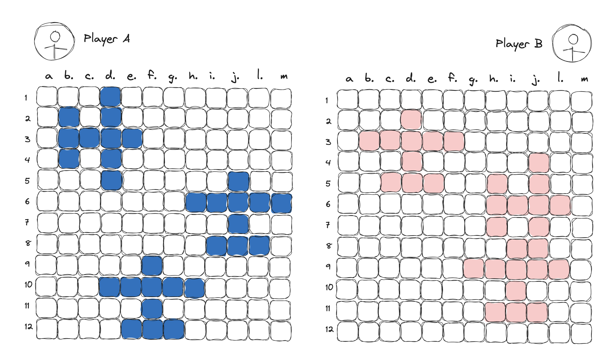
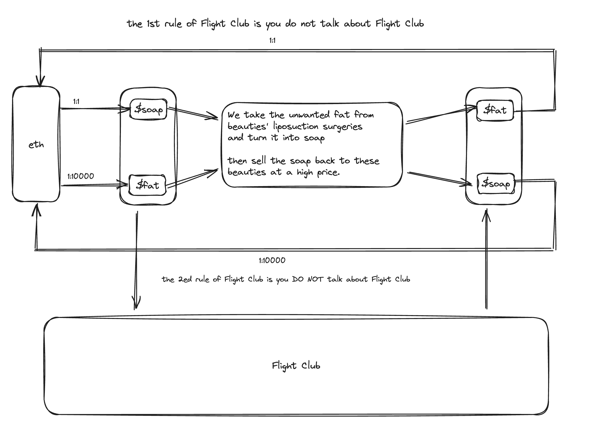

# Flight Club

```
Welcome to Flight Club.

the 1st rule of Flight Club is you do not talk about Flight Club.
the 2nd rule of Flight Club is you DO NOT talk about Flight Club.
the 3rd rule: Protect your own money and withdraw from others.
the 4th rule: Pay 5% of your profit to the Flight Club.

the 5th and final rule: you will NEVER go all in.
```

# 项目介绍

Flight Club 是一个集 meme，Dapp 游戏，博彩，甚至剧本杀 为一身的项目，将会是一个现象级的项目。

## 概念
概念上，Flight Club 致敬了著名的无政府主义符号：由布拉德皮特和爱德华诺顿主演，大卫·芬奇执执导，于 1999 年上映的电影《Fight Club》—— 搏击俱乐部。

《搏击俱乐部》的内核非常丰富，宏观上有对秩序的挑战，微观个人上有表层社会化的躯壳与内心真实的野兽的博弈。很多人第一次观看搏击俱乐部觉得无感，但是时间越长后劲越大，这是meme符号能够流行的最基本特征。

《搏击俱乐部》的符号是现象级的，毋庸置疑，电影概念的病毒式传播在美国乃至全世界造成了长期的社会影响。而 Flight Club 将借这一经典之作的概念在 2024 年的加密世界再次掀起一场风暴。

## 项目形式
形式上，Flight Club 脱胎于一个名叫“炸飞机”的简单的益智游戏，玩家进入 Flight Club 后，可以创建游戏房间，等待其他玩家进入房间开始游戏。

一个房间需要至少两个玩家，上不封顶，但是一般最多 4 名玩家比较好，具体规则细节需要我们团队共同商定。

创建房间时需要设置棋盘大小，飞机数量，玩家数量等信息，后期可以考虑设置飞机形状等更多玩法，增加游戏难度。

以两个玩家对战，在12 * 12的场地，3个飞机的模型为例，玩家 A 和玩家 B 需要先在棋盘上放置自己的飞机:



在玩家A的界面上，玩家B的飞机不可见; 玩家B的界面上，玩家A的飞机不可见。

然后从玩家A开始，双方轮流炸对方的飞机。炸飞机时，有三种可能的情况

- 没有炸中，比如玩家A炸（a, 1），无事发生，
- 炸中机身，比如玩家A炸（d，3），此时玩家A相当于初步定位到飞机位置，但是还不知道机头在哪
- 炸中机头，比如玩家A炸（d，2），此时玩家B的飞机损毁

双方轮流炸飞机，直到某一方的飞机全部损毁，游戏结束。

不同人数，棋盘大小和飞机形状时的游戏时规则同理，只是难度和策略会有不同。

## 博彩元素
为了充分利用人性的弱点，我们在游戏中加入博彩元素，让玩家可以在游戏中赌博，赚取筹码。

规则如下，玩家A在创建房间前，需要设置初始筹码，以直接用ETH质押为例，假设玩家A开了个房间质押了1ETH，然后玩家A可以把房间链接发送给玩家B，玩家B确认自己能负担得起至少1 ETH的损失的话，可以连接钱包，开始游戏。

此时双方各自质押1 ETH给Flight Club的合约，作为奖池，然后开始游戏。

游戏开始后，当玩家A的飞机被炸中机头时，双方开始博弈：
由被炸中机头的玩家A开始选择：
1. 认输，玩家B赢得奖池
2. 继续游戏，且选择加筹码的数量（可以为0倍，2倍，4倍），等待玩家B确认
3. 继续游戏，且ALL IN，等待玩家B确认

玩家B收到玩家A的选择后，可以作出如下选择：
1. 如果玩家A认输，则无需选择，玩家B赢得奖池
2. 如果玩家A选择继续游戏，玩家B确认是否跟筹码
   1. 如果玩家B选择跟筹码，则双方各自质押相同的筹码，继续游戏
   2. 如果玩家B选择不跟筹码，则玩家A赢得奖池
   3. 玩家B也可以在玩家A选择的筹码的基础上继续加筹码，等待玩家A确认，双方轮流确认，直到达成一致，给合约质押筹码
   4. 玩家A选择ALL IN的情况比较特殊，这表示玩家A要与玩家B搏命，玩家B只能选择跟着ALL IN或者认输
      1. 如果玩家B选择跟着ALL IN，则双方将把自己地址上的全部balance都质押给合约作为奖池，后续的游戏中，双方都不能再加筹码，直到游戏结束
      2. 如果玩家B选择不跟着ALL IN，则玩家A赢得奖池

多人游戏的情况类似，只要场上至少两名玩家对筹码达成一致，就可以继续游戏。

该规则脱胎自著名博弈游戏德州扑克，不同风格的选手会有截然不同的选择，在博弈的过程中，玩家将充分享受到博弈的风险与乐趣。

# 项目规划

## 开发

- 按技术实现难度最低的游戏规则开发第一版
  - 前端要求稍微高一点，页面要好看，页面设计上我们依然会蹭搏击俱乐部的IP，技术选型React，怎么快怎么来
  - 后端需要先设计一下，看看是否方便直接一把实现多人游戏，如果不方便，可以先实现两人对战，后续再扩展多人游戏，后端能跑别有bug就行
  - 后续web2的技术升级让社区加入共建；

- 合约
  - 基础的质押筹码，赢得奖池的逻辑
  - 发NFT：搏击俱乐部三个主角的头像NFT，限量5000个，低价mint，留足悬念后期有用
  - 发代币：
    - 方案一：不发代币，直接用ETH质押，这个方案的法律风险是可能会被判定为赌博
    - 方案二：就只发行一种代币`$SOAP`，用来做筹码，由于我们不提供`$SOAP`兑换ETH的服务，所以理论上`$SOAP`跟欢乐豆是一样性质的东西，这种方案法律风险最低，但是套利空间小，主要是利用meme套利
    - 方案三：发行两种代币，名字叫 `$SOAP`和`$FAT`，致敬搏击俱乐部的成员用美女抽脂手术的脂肪做肥皂，然后把肥皂高价卖回给美女们。在通过ETH买代币时，`$SOAP`比`$Fat`要贵，但是在Flight Club游戏中质押时，`$FAT`将比`$SOAP`贵, 这样，最理想的情况下，通过ETH买代币时，玩家手上的`$SOAP`和`$FAT`的分布会相对平均，但是游戏上线后，玩家会迅速明白`$FAT`更有价值，交易市场会自发让`$SOAP`归零，`$FAT`拉升，这样就就能引爆一波情绪，这种方案严格来说有诈骗风险，但是套利空间巨大。最后我们让玩家把`$SOAP`和`$FAT`换成统一的代币`$BOMB`
    

  - 后续NFT：飞机尺NFT，限量10000个，前5000个送给头像持有者，后5000个高价mint; 也可以发Robot Bausen的NFT，发给ALL IN赔光了的玩家。

## 营销
  - 多次复习电影搏击俱乐部，寻找Flight Club和Fight Club的连接点，以此为基点在X上营销布道，吸引用户
  - Discord社区不要太复杂，大概需要四个频道即可，一个公告频道，一个聊天频道，一个游戏频道，一个开发者频道
    - 公告频道用于公布项目进展，以及后续规则的升级
    - 聊天频道用于用户间交流强化meme氛围
      - meme的核心是发自内心的符号认同，不要有任何形式的喊单奖励，要利用电影与现实的结合，让meme自发传播
    - 游戏链接频道只允许发游戏房间链接，玩家可以随意加入游戏房间进行大逃杀
      - 前期用户量少的时候，我们要在游戏频道尽量输给玩家，让玩家获利并自发传播，后期等着收钱就好了
    - 开发者频道可以后期再建设，鼓励开发者参与完善项目技术架构
